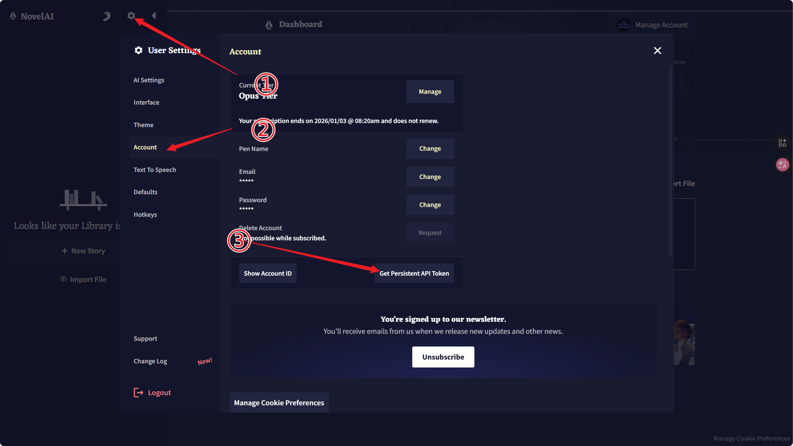
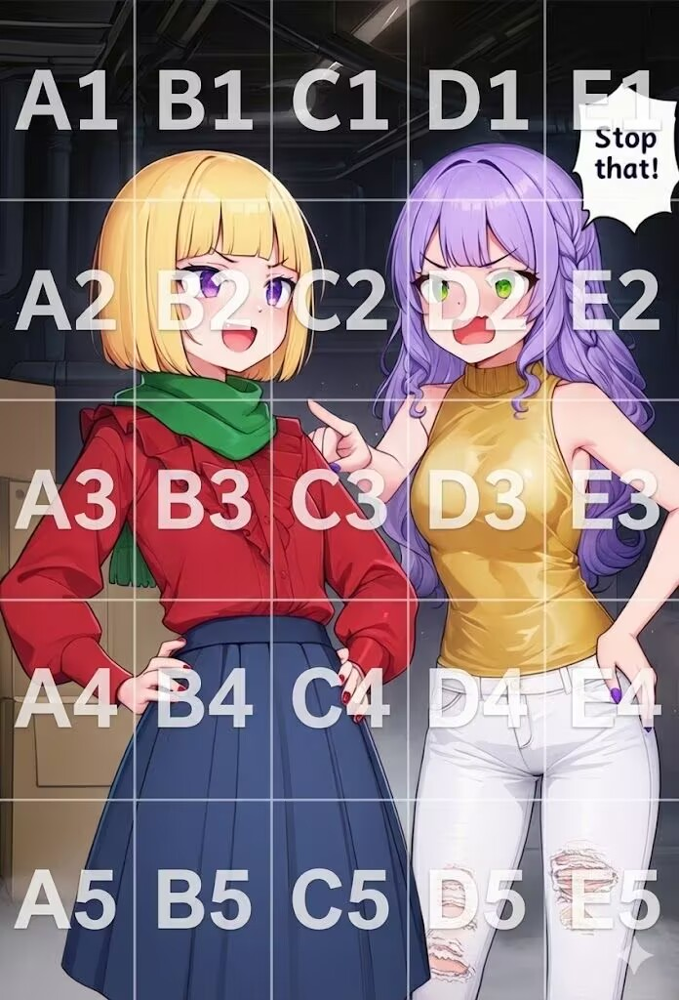

# koishi-plugin-hhs-huatu

[](https://www.npmjs.com/package/koishi-plugin-hhs-huatu)

## 介绍 

该插件基于 [novelai-bot](https://bot.novelai.dev/) 进行二次开发，增添多项实用功能。

**交流群：** [112879548](https://qm.qq.com/q/4nKKvckKbu) - 欢迎加群体验和反馈问题！  
**作者QQ：** 2275438102  
**项目地址：** [GitHub](https://github.com/hhs2275/koishi-plugin-hhs-huatu)

## 🔑 授权令牌的获取

如何获取 NovelAI 的授权令牌（Token），请参考下图：



## ✨ 功能特性


### 🖼️ 以图生图

支持 NovelAI 的图片转图片功能，可调节生成强度和噪声。直接添加图片在指令最后即可触发。

### 🖌️ 局部重绘（Inpainting）

支持 NovelAI V4/V4.5 模型的局部重绘功能，可对图片特定区域进行重新生成：

**使用方法：**
```bash
nai4 -M <提示词> <图片>
```

**交互流程：**
1. 发送命令后，机器人会返回一张调暗的原图
2. 使用画图工具在需要重绘的区域涂上**白色**
3. 在 120 秒内发送涂好的图片
4. 机器人开始局部重绘并返回结果

**技术特点：**
- 采用 8x8 像素网格对齐算法，适配 V4 模型的 Latent 空间
- 自动膨胀处理，确保重绘边缘过渡自然
- 交互过程不占用任务队列

### 🎨 角色提示词功能（Characters）

支持为图像中的不同角色指定独立的提示词和位置。

**通用语法**：`nai模型 场景描述 -K "角色1@位置;角色2@位置"`
- 分隔符：`;` 或 `；`（支持中英文分号）
- 负向提示：`--uc:xxx` 可为单个角色指定负向提示
- 位置可省略，省略时默认 `C3`（画面中心），AI 会自动调整多个角色的相对位置

> ⚠️ **注意：V4/V4.5 与 V5 的位置写法不同，请按所用模型选择下面对应的定位方式。**

#### 🔲 方式一：5×5 网格定位 —— V4 / V4.5 模型

适用模型：`nai-diffusion-4-curated-preview` (`nai4c`)、`nai-diffusion-4-full` (`nai4`)、`nai-diffusion-4-5-curated` (`nai4-5c`)、`nai-diffusion-4-5-full` (`nai4-5`)

位置使用网格编号 **`A1` ~ `E5`**：


```
     A    B    C    D    E
1   A1   B1   C1   D1   E1  (顶部)
2   A2   B2   C2   D2   E2
3   A3   B3   C3   D3   E3  (中心)
4   A4   B4   C4   D4   E4
5   A5   B5   C5   D5   E5  (底部)
   (左)            (右)
```

- 字母表示横向：`A`(左) → `B` → `C`(中) → `D` → `E`(右)
- 数字表示纵向：`1`(上) → `2` → `3`(中) → `4` → `5`(下)


图中叠加了完整的 5×5 网格：左侧角色约在 `B3`，右侧角色约在 `D3`，对照下表即可选位。


**示例：**
```bash
# 基本格式
nai4 场景描述 -K "角色1@B3;角色2@D3"

# 使用中文分号 + 负向提示
nai4-5 场景 -K "1girl, smile@B3 --uc:frown；1boy, tall@D2 --uc:short"
```

#### 🆓 方式二：自由坐标定位 —— 仅 V5 模型

适用模型：`nai-diffusion-5-curated` (`nai5c`)、`nai-diffusion-5-full` (`nai5`)

对应 NAI 5 官方网页版的自由拖拽定位，位置使用**连续坐标 `x,y`**：

- 写法：`@x,y` 或 `@(x,y)`，如 `@0.25,0.7`
- 值域 `0 ~ 1`：`(0, 0)` 为左上角，`(1, 1)` 为右下角，`(0.5, 0.5)` 为画面中心
- 不受网格限制，可精确摆放在任意位置（自动截断到 3 位小数，超出范围自动约束到边界内）

**示例：**
```bash
# 双人自由定位
nai5 场景 -K "1girl, red hair@0.25,0.7 --uc:frown;1boy@(0.75,0.6)"

# 精确的中心偏移（网格无法表达的点）
nai5 portrait -K "1girl, close-up@0.5,0.42"
```

> 💡 兼容性说明：V5 模型也接受旧的网格写法（如 `@B3`）；连续坐标在 V4/V4.5 下同样有效，但推荐按上述方式对应使用。


### 🎯 精准参考（Precise Reference）（仅支持 v4.5 模型）（原角色参考）

支持 NovelAI v4.5 模型的精准参考功能，允许上传多张参考图来进行角色或风格的控制。

**使用方法：**
```bash
nai4-5 <提示词> -P -p "cs,1,1;c,0.8,0.9"
```

**交互流程：**
1. 发送上述指令后，机器人会提示等待发送精确参考图片。
2. 在 60 秒内发送图片（支持一次发送多张或分段发送），最多可支持 6 张。
3. 图片发送完毕后，回复“开始”执行绘画，若要放弃则回复“取消”。

**参数定义 (-p)：**
- **多图分割**：使用分号（`;` 或 `；`）隔开对应不同图片的参数设定。
- **设值格式**：`模式,强度,保真度`（默认值：`cs,1,1`）
  - **模式 (Mode)**：可选 `cs`（角色+风格）、`c`（仅角色）或 `s`（仅风格）
  - **强度 (Strength)**：0 ~ 1 的数字
  - **保真度 (Fidelity)**：0 ~ 1 的数字
  
> **注意：** 此功能在使用时会消耗额外的 Anlas（每张参考图额外扣除 5 点数）。

### 🎬 导演工具

支持多种图像处理工具：
- **线稿提取**：提取图像线条
- **素描转换**：转换为素描风格
- **背景移除**：智能移除背景
- **图像上色**：为线稿上色
- **表情修改**：调整角色表情
- **删除文字**：移除图片中的文字

发送 `help 导演工具` 查看详细说明。

### 📋 智能队列系统

解决多用户同时使用时的 429 错误问题：
- 支持限制总队列数量和单用户队列数量
- 超出限制自动进入冷却时间，防止滥用
- 多 Token 池支持，提高并发处理能力
- 管理员可使用 `novelai.reset-queue <user>` 重置用户队列状态

### 🔄 便捷重画功能

一键重新生成之前的作品：
- 支持灵活的指令格式：`重画`、`重画一下`、`重画两张`、`重画2张`等
- 支持重画 1-10 张图片
- 自动使用上次的参数

### 💰 点数控制系统

按 NovelAI 官网前端公式模拟 Anlas 消耗并预扣费，确保消耗透明且防止恶意刷图。

**计费细则：**
- **默认消耗**：`ceil(2.951823174884865e-6 × 像素 + 5.753298233447344e-7 × 像素 × 步数)`。
- **V5（nai5 / nai5c）**：在上述结果上再乘 **1.5**。例如 832×1216、28 步超额时，V4.5 为 20、V5 为 30。
- **SMEA / DYN 加成**：SMEA 单独开启 **1.2 倍**，同时开启 SMEA 和 DYN **1.4 倍**。
- **以图生图**：按去噪强度（`strength`）缩放后向上取整，最少 2 点。
- **精确参考（-P）**：有参考图时取消 Opus 免费档，并每张参考图额外扣除 5 点数。
- **导演工具（Director Tools）**：
  - 普清免扣：分辨率在 `1024×1024`（或 1,048,576 像素）及以下时，处理**免收基础点数**。
  - 高清计费：超过安全像素后根据公式 `像素数 ÷ 50000 - 1.8` 收取超额积分。
  - **背景移除（bg-removal）**：单独的高耗能功能，使用时将在原本成本上强制**额外增加 65 点消耗**。

> **提示：** 因网络、超时、官方服务器熔断等原因导致的执行失败，系统会在阻断生成的瞬间启动安全机制，将已预扣的点数**全额退还**至您的账户。

### 👥 会员系统（可选）

完善的会员管理系统，支持差异化服务：

**基础功能：**
- ✅ 会员权限管理（授予/取消/查询）
- ✅ 自动叠加会员时长
- ✅ 差异化的每日使用限额和冷却时间
- ✅ 会员列表查看（支持分页）

**高级功能：**
- ✅ **自动清理**：定时清理过期会员和不活跃用户数据
- ✅ **到期提醒**：提前提醒即将到期的会员
- ✅ **调试工具**：管理员可手动触发清理和提醒任务

**相关指令：**
```bash
会员              # 查询自己的会员状态
会员 -u <QQ号>    # 查询指定用户状态（需管理员权限）
会员 -u <QQ号> -d <天数>  # 授予会员（需管理员权限）
会员 -u <QQ号> -c         # 取消会员（需管理员权限）
会员 -l           # 查看所有会员列表
会员调试 -s       # 查看定时任务状态（需配置启用）
会员调试 -c       # 立即执行清理任务
会员调试 -r       # 立即执行提醒任务
```

使用 `help 会员` 查看完整指令说明。

### 🛡️ 图片审核系统

自动审核生成的图片，过滤不当内容：
- 支持腾讯云和 API4AI 审核引擎
- 可配置审核失败时的处理方式（阻止发送/忽略）
- 支持自动禁言违规用户
- 可指定审核的群组范围

### ⚙️ 其他功能

- **多模型支持**：快捷指令 `nai4`、`nai4c`、`nai4-5`、`nai4-5c`、`nai5`、`nai5c` 直接调用不同模型
- **Opus 额度保护**：使用 `/配额` 查看 Opus 免费 V5 额度、下次恢复时间和状态；额度耗尽时默认阻止 `nai5`/`nai5c`，可在配置中开启允许消耗 Anlas 的熔断开关
- **参数调整**：`-R` 参数调整 cfg_rescale（范围 0-1）
- **调试模式**：可配置是否输出详细调试日志

## 使用说明

### 基本指令

```bash
# 文本生图
nai <提示词>                    # 使用默认模型
nai4 <提示词>                   # 使用 v4 full 模型
nai4c <提示词>                  # 使用 v4 curated 模型
nai4-5 <提示词>                 # 使用 v4.5 full 模型
nai4-5c <提示词>                # 使用 v4.5 curated 模型
nai5 <提示词>                   # 使用 v5 full 模型
nai5c <提示词>                  # 使用 v5 curated 模型
/配额                           # 查看 Opus 免费 V5 额度

# 局部重绘（仅 v4/v4.5）
nai4 <提示词> <图片> -M

# 角色提示词（v4/v4.5 网格定位 @B3；v5 自由坐标定位 @0.35,0.62）
nai4 场景 -K "角色1@B3;角色2@D3"
nai5 场景 -K "角色1@0.25,0.7;角色2@(0.75,0.6)"

# 常用参数
-m <模型>      # 指定模型
-r <分辨率>    # 指定分辨率（portrait/landscape/square 或 宽x高）
-s <采样器>    # 指定采样器
-t <步数>      # 迭代步数
-x <种子>      # 随机种子
-c <scale>     # CFG Scale
-R <rescale>   # CFG Rescale (0-1)
-u <负向提示>  # 负向提示词
-M             # 启用局部重绘模式
-K <角色>      # 角色提示词
-P             # 启用精准参考功能（仅 v4.5）
-p <参数>      # 精准参考参数配置 (如 "cs,1,1")

# 重画功能
重画          # 重画上一张
重画 3        # 重画 3 张
```

详细指令使用 `help nai` 查看。

---

## 图片审核配置

### 腾讯云审核

本功能使用数据万象 CI 为用户提供低延时、准确、标签丰富的内容审核服务，采用前沿的识别算法，结合海量的违规数据进行训练建模，对图片进行敏感内容审核，过滤色情性感、违法违规、广告宣传等多个场景。

#### 价格说明

- **免费额度**：10万次/2个月（图片审核）
- **新用户优惠**：可在 [数据万象专场特惠](https://cloud.tencent.com/act/pro/ci) 低价购买额度
- **有效期**：1年（付费额度）

#### 配置步骤

配置需要获取 5 个值：`SecretId`、`SecretKey`、`Bucket`、`Region`、`BizType`

##### 1. 获取 Bucket
1. 登录数据万象控制台，点击概览，再点击立即开通服务。
2. 点击授权。
3. 点击同意授权。
4. 点击绑定存储桶。
5. 点击新建，输入存储桶名称，选择一个所属地域，点击确定。

> **注意**: 内容审核仅支持以下地域：北京、上海、广州、成都、重庆、南京、中国香港、新加坡、孟买、法兰克福。

> **提示**: Bucket 的值为存储桶名称，一般由你输入的存储桶名称加上十位随机数组成，例如 test-1250000000。

##### 2. 获取 Region
Region 的值一般为 ap- 加上你选择的所属地域的拼音，以下为对照表：

| 所属地域 | 地域 |
| -------- | ---- |
| 华北地区（北京） | ap-beijing |
| 华东地区（上海） | ap-shanghai |
| 华南地区（广州） | ap-guangzhou |
| 西南地区（成都） | ap-chengdu |
| 西南地区（重庆） | ap-chongqing |
| 华东地区（南京） | ap-nanjing |
| 港澳台地区（中国香港） | ap-hongkong |
| 亚太东南地区（新加坡） | ap-singapore |
| 亚太东南地区（孟买） | ap-mumbai |
| 欧洲地区（法兰克福） | eu-frankfurt |

> **提示**: Region 的值为存储桶所在的地域，例如 ap-beijing。

##### 3. 获取 BizType
找到刚才新建的存储桶，点击管理，点击内容审核，点击审核策略，复制默认策略的 BizType 值。

> **提示**: BizType 的值为审核策略的名称，例如 912f9a305ae1101b9f7430435ec51f66。

##### 4. 获取 SecretId
1. 登录访问管理控制台，点击云 API 密钥。
2. 点击新建密钥。
3. 请先牢记 SecretId 和 SecretKey，然后点击确定。

> **注意**: SecretKey 只会展示一次，关闭后将再也无法看见，且尤为重要，请务必保存好。

> **提示**: SecretId 的值请自行参考上述步骤获取。

##### 5. 获取 SecretKey

参考获取 SecretId 步骤获取 SecretKey。

**访问管理控制台：** [https://console.cloud.tencent.com/ci/secret](https://console.cloud.tencent.com/ci/secret)

---

## 常见问题

### 如何使用局部重绘功能？

1. 确保使用 v4 或 v4.5 模型（`nai4`、`nai4c`、`nai4-5`、`nai4-5c`）
2. 发送命令时添加 `-M` 参数和要重绘的原图
3. 收到调暗的图片后，使用画图工具涂白需要重绘的区域
4. 在 120 秒内发送涂好的图片
5. 等待生成结果

**注意事项：**
- 涂白区域要覆盖完整需要重绘的部分
- 建议使用较粗的画笔（4像素以上）
- 如果边缘出现瑕疵，可以尝试扩大涂白区域

### 如何使用角色提示词功能？

详见上方「[🎨 角色提示词功能（Characters）](#-角色提示词功能characters)」一节：V4/V4.5 用 5×5 网格定位（`@B3`），V5 推荐自由坐标定位（`@0.35,0.62`）。

### 会员系统如何配置？

1. 在插件配置中启用"会员系统"
2. 设置会员和非会员的每日限额、冷却时间
3. 管理员使用 `会员 -u <QQ号> -d <天数>` 授予会员
4. （可选）配置自动清理和到期提醒

### 如何查看调试日志？

在插件配置的"高级设置"中启用"调试日志"选项，可以看到详细的运行日志，包括角色提示词解析和图片审核的详细信息。

---

## 更新日志

### v1.2.7

- ✨ **NAI 5 角色自由坐标定位**
  - 角色位置支持连续坐标写法 `@x,y` / `@(x,y)`（值域 0~1，自动截断 3 位小数、约束越界值）
  - 对应 NAI 5 官方网页版/naicmd 的最新自由拖拽定位方式，`nai5` / `nai5c` 推荐使用
  - 原有 5×5 网格写法（`@B3`）在所有模型下继续有效，完全向后兼容

### v1.2.0

- ✨ 新增 `/配额` 指令，显示 NovelAI Opus 免费 V5 额度、下次恢复时间和状态
- 🛡️ 新增 Opus 额度保护：额度耗尽时默认阻止 `nai5`/`nai5c`，可配置为允许消耗 Anlas 继续生成

### v0.4.0 (2024-12-06)

- ✨ **新增精准参考功能（Precise Reference）**
  - 完全替换旧版的角色参考功能
  - 支持交互式多图参考（最多6张），可灵活调整每张图的偏好设定
  - 提供全新的命令行参数 `-p` 自定义模式、强度以及保真度
- ✨ **新增局部重绘功能（Inpainting）**
  - 支持 V4/V4.5 模型的局部重绘
  - 采用 8x8 网格对齐 + 膨胀算法，防止边缘伪影
  - 交互流程不占用任务队列
- 🔧 优化 Mask 处理算法，提升重绘质量
- 🐛 修复各种已知问题

### 历史版本

- ✨ 新增角色提示词功能（Characters），支持多角色分别设置位置和提示词
- ✨ 新增导演工具功能
- ✨ 会员系统增强：自动清理、到期提醒、调试指令
- ✨ 新增 `nai4c` 快捷指令（v4 curated 模型）
- ✨ 新增调试日志开关配置
- 🐛 修复各种已知问题

---

## 相关链接

- [GitHub 项目地址](https://github.com/hhs2275/koishi-plugin-hhs-huatu)
- [NovelAI 官网](https://novelai.net/)
- [原插件项目](https://bot.novelai.dev/)
- [交流群](https://qm.qq.com/q/4nKKvckKbu)

## 许可证

本插件基于原 novelai-bot 项目开发，遵循相应开源协议。
